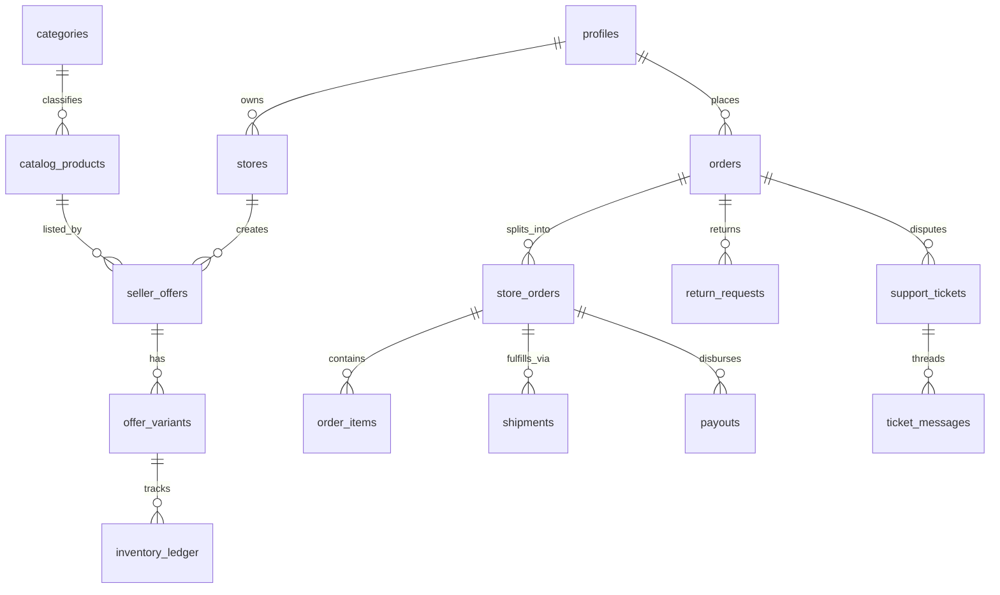

# WAW (واو) Marketplace — Authoritative Canonical Schema Dictionary

**Target Standard:** Pakistan Multi-Vendor Marketplace Operating System  
**Baseline Database Engine:** PostgreSQL 15+ (Supabase)  
**Schema State:** Canonical converged contract (No legacy table references allowed)

---

## 1. Canonical Table Registry

---

## 2. Table Specifications & Data Dictionary

### 1. `profiles`
*Core user identity and authentication credentials.*
- `id` (`UUID`, PK): Matches `auth.users.id`.
- `phone` (`VARCHAR(20)`, UNIQUE, NOT NULL): Pakistani phone number (e.g. `+923001234567`).
- `full_name` (`VARCHAR(100)`): Display name.
- `email` (`VARCHAR(255)`, NULLABLE): Optional customer email.
- `role` (`VARCHAR(20)`, DEFAULT `'BUYER'`): Enum (`BUYER`, `SELLER`, `ADMIN`, `SUPER_ADMIN`).
- `created_at`, `updated_at` (`TIMESTAMPTZ`).

### 2. `stores`
*Merchant multi-vendor store entities and KYC verification.*
- `id` (`UUID`, PK).
- `owner_id` (`UUID`, FK -> `profiles.id`, NOT NULL).
- `name` (`VARCHAR(100)`, NOT NULL).
- `slug` (`VARCHAR(100)`, UNIQUE, NOT NULL): Human-readable store URL.
- `city` (`VARCHAR(50)`, NOT NULL): Origin dispatch hub.
- `seller_type` (`VARCHAR(20)`, DEFAULT `'THIRD_PARTY'`): `'FIRST_PARTY'` | `'THIRD_PARTY'`.
- `status` (`VARCHAR(20)`, DEFAULT `'PENDING_KYC'`): `'PENDING_KYC'` | `'ACTIVE'` | `'SUSPENDED'`.
- `is_verified` (`BOOLEAN`, DEFAULT `false`).
- `cnic_number` (`VARCHAR(20)`): Formatted `XXXXX-XXXXXXX-X` (Masked on read).
- `iban` (`VARCHAR(34)`): 24-character Pakistani IBAN `PK...` (Masked on read).
- `commission_rate_percentage` (`NUMERIC(5,2)`, DEFAULT `10.00`).

### 3. `categories`
*Hierarchical product categories with bilingual support (EN/UR).*
- `id` (`UUID`, PK).
- `name` (`VARCHAR(100)`, NOT NULL).
- `name_urdu` (`VARCHAR(100)`): Urdu typography name.
- `slug` (`VARCHAR(100)`, UNIQUE, NOT NULL).
- `parent_id` (`UUID`, FK -> `categories.id`, NULLABLE).
- `commission_percentage` (`NUMERIC(5,2)`, DEFAULT `10.00`).
- `is_active` (`BOOLEAN`, DEFAULT `true`).

### 4. `catalog_products`
*Canonical master catalog definitions.*
- `id` (`UUID`, PK).
- `title` (`VARCHAR(255)`, NOT NULL).
- `title_urdu` (`VARCHAR(255)`).
- `slug` (`VARCHAR(255)`, UNIQUE, NOT NULL).
- `description` (`TEXT`, NOT NULL).
- `category_id` (`UUID`, FK -> `categories.id`, NOT NULL).
- `attributes` (`JSONB`, DEFAULT `'{}'`): Specifications, highlights, sizing.
- `images` (`TEXT[]`, DEFAULT `'{}'`).
- `thumbnail` (`TEXT`).
- `is_active` (`BOOLEAN`, DEFAULT `true`).

### 5. `seller_offers`
*Merchant listings linked to master catalog products.*
- `id` (`UUID`, PK).
- `catalog_product_id` (`UUID`, FK -> `catalog_products.id`, NOT NULL).
- `store_id` (`UUID`, FK -> `stores.id`, NOT NULL).
- `sku` (`VARCHAR(100)`, NOT NULL).
- `price_pkr` (`NUMERIC(10,2)`, NOT NULL).
- `original_price_pkr` (`NUMERIC(10,2)`).
- `condition` (`VARCHAR(20)`, DEFAULT `'NEW'`): `'NEW'` | `'REFURBISHED'`.
- `is_express` (`BOOLEAN`, DEFAULT `false`).
- `status` (`VARCHAR(20)`, DEFAULT `'PENDING'`): `'PENDING'` | `'ACTIVE'` | `'REJECTED'` | `'PAUSED'`.

### 6. `offer_variants`
*Color, size, and model SKU variations.*
- `id` (`UUID`, PK).
- `seller_offer_id` (`UUID`, FK -> `seller_offers.id`, NOT NULL).
- `sku` (`VARCHAR(100)`, UNIQUE, NOT NULL).
- `variant_name` (`VARCHAR(100)`, NOT NULL): e.g. `'Size: 42 / Black'`.
- `price_adjustment_pkr` (`NUMERIC(10,2)`, DEFAULT `0.00`).
- `is_active` (`BOOLEAN`, DEFAULT `true`).

### 7. `inventory_ledger`
*Authoritative double-entry stock movement ledger.*
- `id` (`UUID`, PK).
- `offer_variant_id` (`UUID`, FK -> `offer_variants.id`, NOT NULL).
- `transaction_type` (`VARCHAR(30)`, NOT NULL):
  - `RESTOCK` ($+Q$)
  - `RESERVE` ($-Q$, on checkout)
  - `RELEASE` ($+Q$, on abandonment/cancellation)
  - `RETURN_RESTOCK` ($+Q$, on approved refund)
  - `DAMAGE_ADJUSTMENT` ($-Q$)
- `quantity` (`INTEGER`, NOT NULL).
- `order_id` (`UUID`, NULLABLE).
- `reference_id` (`VARCHAR(100)`, NOT NULL).
- `created_at` (`TIMESTAMPTZ`, DEFAULT `NOW()`).

### 8. `orders`
*Top-level multi-vendor customer orders.*
- `id` (`UUID`, PK).
- `buyer_id` (`UUID`, FK -> `profiles.id`, NOT NULL).
- `order_reference` (`VARCHAR(30)`, UNIQUE, NOT NULL): e.g. `'WAW-88492'`.
- `total_amount_pkr` (`NUMERIC(10,2)`, NOT NULL).
- `shipping_fee_pkr` (`NUMERIC(10,2)`, DEFAULT `0.00`).
- `cod_surcharge_pkr` (`NUMERIC(10,2)`, DEFAULT `0.00`).
- `global_status` (`VARCHAR(30)`, DEFAULT `'PENDING'`):
  - `'PENDING'` -> `'CONFIRMED'` -> `'SHIPPED'` -> `'DELIVERED'` -> `'REFUNDED'` / `'CANCELLED'`
- `payment_status` (`VARCHAR(30)`, DEFAULT `'UNPAID'`): `'UNPAID'` | `'PAID'` | `'REFUNDED'`.
- `payment_method` (`VARCHAR(30)`, NOT NULL): `'COD'` | `'XPAY_CARD'` | `'XPAY_RAAST_DYNAMIC'`.
- `shipping_address` (`JSONB`, NOT NULL): Full name, phone, city, address.
- `delivered_at` (`TIMESTAMPTZ`, NULLABLE).

### 9. `store_orders`
*Seller-partitioned sub-orders.*
- `id` (`UUID`, PK).
- `order_id` (`UUID`, FK -> `orders.id`, NOT NULL).
- `store_id` (`UUID`, FK -> `stores.id`, NOT NULL).
- `total_pkr` (`NUMERIC(10,2)`, NOT NULL).
- `commission_pkr` (`NUMERIC(10,2)`, NOT NULL).
- `status` (`VARCHAR(30)`, DEFAULT `'PENDING'`).

### 10. `order_items`
*Sub-order line items.*
- `id` (`UUID`, PK).
- `store_order_id` (`UUID`, FK -> `store_orders.id`, NOT NULL).
- `offer_variant_id` (`UUID`, FK -> `offer_variants.id`, NOT NULL).
- `quantity` (`INTEGER`, NOT NULL).
- `unit_price_pkr` (`NUMERIC(10,2)`, NOT NULL).
- `total_price_pkr` (`NUMERIC(10,2)`, NOT NULL).

### 11. `shipments`
*Logistics tracking and courier consignments.*
- `id` (`UUID`, PK).
- `order_id` (`UUID`, FK -> `orders.id`, NOT NULL).
- `store_order_id` (`UUID`, FK -> `store_orders.id`, NOT NULL).
- `courier` (`VARCHAR(30)`, DEFAULT `'POSTEX'`): `'POSTEX'` | `'TRAX'` | `'LEOPARDS'`.
- `tracking_number` (`VARCHAR(100)`, NOT NULL): e.g. `'PTX-9824-32'`.
- `status` (`VARCHAR(30)`, DEFAULT `'PROCESSING'`): `'PROCESSING'` | `'SHIPPED'` | `'DELIVERED'` | `'RETURNED'`.
- `is_cod` (`BOOLEAN`, DEFAULT `false`).
- `cod_amount_pkr` (`NUMERIC(10,2)`, DEFAULT `0.00`).
- `delivered_at` (`TIMESTAMPTZ`, NULLABLE).

### 12. `payouts`
*Vendor escrow disbursements and automated settlement.*
- `id` (`UUID`, PK).
- `store_id` (`UUID`, FK -> `stores.id`, NOT NULL).
- `store_order_id` (`UUID`, FK -> `store_orders.id`, UNIQUE, NOT NULL).
- `order_id` (`UUID`, FK -> `orders.id`, NOT NULL).
- `amount_pkr` (`NUMERIC(10,2)`, NOT NULL): Net after commission.
- `status` (`VARCHAR(30)`, DEFAULT `'SCHEDULED'`):
  - `'SCHEDULED'` ($T+7$ maturity)
  - `'PROCESSING'` (disbursement queue)
  - `'COMPLETED'` (cleared)
  - `'HELD'` (dispute / return freeze)
  - `'CANCELLED'` (refunded)
- `scheduled_for` (`TIMESTAMPTZ`, NOT NULL): Delivered date $+ 7$ days.
- `processed_at` (`TIMESTAMPTZ`, NULLABLE).

### 13. `return_requests`
*7-day consumer return requests and reverse logistics.*
- `id` (`UUID`, PK).
- `order_id` (`UUID`, FK -> `orders.id`, NOT NULL).
- `buyer_id` (`UUID`, FK -> `profiles.id`, NOT NULL).
- `reason` (`VARCHAR(50)`, NOT NULL): `'DEFECTIVE_OR_DAMAGED'` | `'WRONG_ITEM_DELIVERED'` | `'SIZE_OR_FIT_MISMATCH'` | `'NOT_AS_DESCRIBED'`.
- `reverse_tracking_number` (`VARCHAR(100)`): e.g. `'REV-PTX-...'`.
- `evidence_images` (`TEXT[]`).
- `status` (`VARCHAR(30)`, DEFAULT `'PENDING_REVIEW'`): `'PENDING_REVIEW'` | `'REVERSE_PICKUP_BOOKED'` | `'RECEIVED'` | `'REFUNDED'` | `'REJECTED'`.
- `refund_amount_pkr` (`NUMERIC(10,2)`).

### 14. `support_tickets` & `ticket_messages`
*Multi-party customer support and dispute threads.*
- `support_tickets`:
  - `id` (`UUID`, PK).
  - `buyer_id` (`UUID`, FK -> `profiles.id`, NOT NULL).
  - `order_id` (`UUID`, FK -> `orders.id`, NULLABLE).
  - `store_id` (`UUID`, FK -> `stores.id`, NULLABLE).
  - `subject` (`VARCHAR(255)`, NOT NULL).
  - `reason` (`VARCHAR(50)`).
  - `status` (`VARCHAR(30)`, DEFAULT `'OPEN'`): `'OPEN'` | `'UNDER_REVIEW'` | `'RESOLVED'` | `'CLOSED'`.
  - `resolution` (`VARCHAR(50)`): `'REFUND_BUYER'` | `'RELEASE_SELLER_PAYOUT'` | `'REPLACEMENT_ISSUED'` | `'DISMISSED'`.
- `ticket_messages`:
  - `id` (`UUID`, PK).
  - `ticket_id` (`UUID`, FK -> `support_tickets.id`, NOT NULL).
  - `sender_id` (`UUID`, NOT NULL).
  - `sender_role` (`VARCHAR(20)`, NOT NULL): `'BUYER'` | `'SELLER'` | `'ADMIN'`.
  - `sender_name` (`VARCHAR(100)`).
  - `message` (`TEXT`, NOT NULL).
  - `attachments` (`TEXT[]`).
  - `created_at` (`TIMESTAMPTZ`, DEFAULT `NOW()`).

### 15. `ai_usage`
*Tracks OpenRouter API usage for subscription gating and daily limits.*
- `id` (`UUID`, PK).
- `user_id` (`UUID`, FK -> `auth.users.id`, NULLABLE).
- `feature` (`TEXT`, NOT NULL): `'description_generator'` | `'chatbot'` | `'recommendations'` | `'search'`.
- `prompt_tokens` (`INTEGER`, DEFAULT `0`).
- `completion_tokens` (`INTEGER`, DEFAULT `0`).
- `total_tokens` (`INTEGER`, DEFAULT `0`).
- `model` (`TEXT`, NOT NULL).
- `metadata` (`JSONB`, DEFAULT `'{}'`).
- `created_at` (`TIMESTAMPTZ`, DEFAULT `NOW()`).
- **Indexes:** `(created_at)`, `(user_id, created_at)`, `(feature, created_at)`.

### 16. `reviews`
*Buyer product reviews with verified-purchase badges.*
- `id` (`UUID`, PK).
- `product_id` (`UUID`, FK -> `offer_variants.id`, NOT NULL).
- `user_id` (`UUID`, FK -> `profiles.id`, NOT NULL).
- `rating` (`INTEGER`, NOT NULL): 1-5 stars.
- `comment` (`TEXT`).
- `is_verified_purchase` (`BOOLEAN`, DEFAULT `false`).
- `status` (`VARCHAR(20)`, DEFAULT `'APPROVED'`): `'APPROVED'` | `'PENDING'` | `'REJECTED'`.
- `created_at` (`TIMESTAMPTZ`, DEFAULT `NOW()`).

### 17. `wishlist`
*Buyer saved products for later.*
- `id` (`UUID`, PK).
- `user_id` (`UUID`, FK -> `profiles.id`, NOT NULL).
- `product_id` (`TEXT`, NOT NULL).
- `created_at` (`TIMESTAMPTZ`, DEFAULT `NOW()`).
- **Unique constraint:** `(user_id, product_id)`.

---

## 3. RLS Security & Exposure Policy

| Table | Anonymous Public | Authenticated Buyer | Authenticated Seller | Super Admin |
|---|---|---|---|---|
| `catalog_products` | `SELECT (is_active=true)` | `SELECT` | `SELECT, INSERT (pending)` | `ALL` |
| `seller_offers` | `SELECT (status=ACTIVE)` | `SELECT` | `SELECT (store_id), INSERT` | `ALL` |
| `inventory_ledger` | ❌ **DENIED** | ❌ **DENIED** | `SELECT (via view)` | `ALL` |
| `orders` | ❌ **DENIED** | `SELECT (buyer_id=uid)` | ❌ **DENIED** | `ALL` |
| `store_orders` | ❌ **DENIED** | ❌ **DENIED** | `SELECT (store_id=store)` | `ALL` |
| `payouts` | ❌ **DENIED** | ❌ **DENIED** | `SELECT (store_id=store)` | `ALL` |
| `profiles` (CNIC/IBAN) | ❌ **DENIED** | `SELECT (id=uid)` | `SELECT (id=uid, masked)` | `ALL` |
